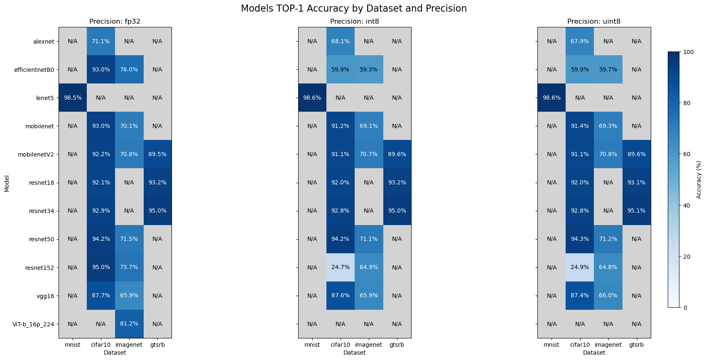

# deepvault
This repository brings together a personally curated collection of pre-trained models and datasets, designed to cut through the chaos of searching the internet for reliable resources. 

If you've ever felt lost in the jungle of scattered links and half-documented models—this is for you. Enjoy!



## How to Use

The repository is organized by dataset. Follow these steps to use a model:

0. **Clone the repository**

  ```bash
    git clone https://github.com/jackperlo/deepvault.git
    cd deepvault
  ```

1. **Choose a Dataset**  
  Navigate to the folder of the dataset you’re interested in.

2. **Download or Train a Model**
  Find the corresponding model folder (e.g., `Mnist/CNN/Lenet5`)

  - **(a) Use a Custom Model**  
    Use the corresponding notebook to train or customize your model. Once ready, save it in the desired format (FP32/INT8/UINT8).

  - **(b) Use a Pre-trained Model**  
    Run the provided shell script to download the model. For example:

    ```bash
    bash download_<DESIRED-MODEL>.sh
    ```

    Or, if needed:

    ```bash
    chmod +x download_<DESIRED-MODEL>.sh
    ./download_<DESIRED-MODEL>.sh
    ```

3. **Preprocess the Dataset**  
  Use the corresponding `<DS>_preprocessing.ipynb` notebook to preprocess the dataset images correctly and store them in the required format.

4. **Evaluate the Model**  
  Run evaluation on a portion or the entirety of the preprocessed dataset using the corresponding `<DS>_models_evaluation.ipynb` and choosing the desired model inside the notebook cells.
